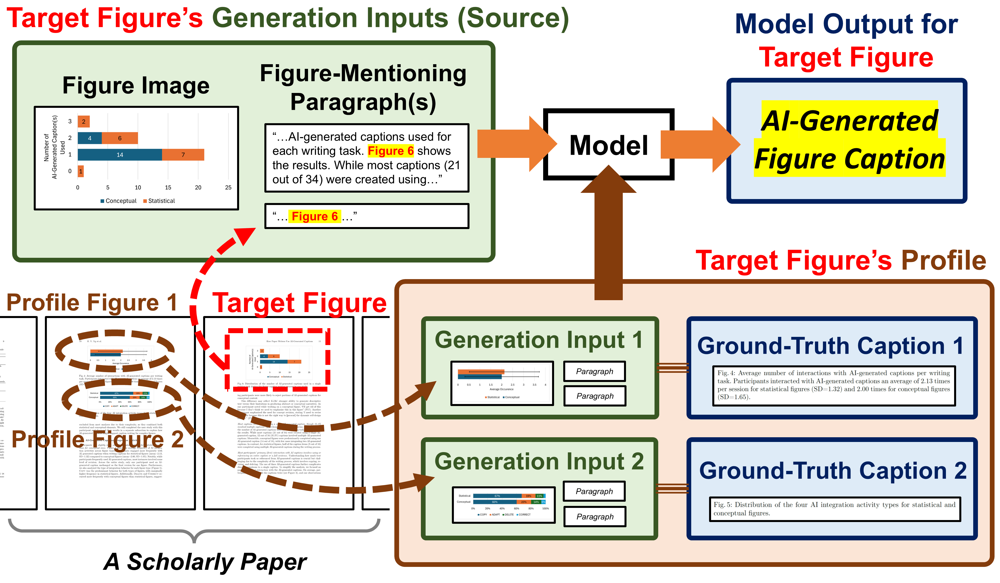

# LaMP-Cap: Personalized Scientific Figure Captioning Dataset
---
LaMP-Cap is an extension of the [SciCap dataset](https://aclanthology.org/2021.findings-emnlp.277/), designed specifically for **personalized and context-aware scientific figure caption generation**. Unlike traditional caption datasets, LaMP-Cap provides not only target figures and their metadata, but also **profile figures** from the same scientific paper, enabling research into leveraging multimodal context for improved captioning.

LaMP-Cap is intended for **non-commercial research only** and is released under the [CC BY-NC-SA 4.0 license](http://creativecommons.org/licenses/by-nc-sa/4.0/). By using LaMP-Cap, you agree to the terms in the license.



## How to Cite?
---
```
@article{ng2025lamp,
  title={LaMP-Cap: Personalized Figure Caption Generation With Multimodal Figure Profiles},
  author={Ng, Ho Yin'Sam' and Hsu, Ting-Yao and Ramakrishnan, Aashish Anantha and Kveton, Branislav and Lipka, Nedim and Dernoncourt, Franck and Lee, Dongwon and Yu, Tong and Kim, Sungchul and Rossi, Ryan A and others},
  journal={arXiv preprint arXiv:2506.06561},
  year={2025}
}
```


## Dataset Description
---
LaMP-Cap is curated from the [SciCap Challenge Dataset](https://huggingface.co/datasets/CrowdAILab/scicap) and focuses on personalized captioning, where **profile figures** (related images and captions from the same paper) provide rich context for the target figure. This design supports the study of **context-aware and user-personalized caption generation** in scientific domains.


## Download the SciCap Dataset
---
You can dowload the original SciCap dataset here: [Download Link](https://github.com/tingyaohsu/SciCap/blob/main/README.md) in the "Download the Dataset"

Our LaMP-Cap data is based on metadata files from the SciCap Challenge dataset. Each arXiv paper groups its figures together. We randomly picked one figure per paper as the target, and the rest became profile figures. Our metadata only includes papers with at least two figures (so each target has at least one profile figure). This means only part of the original SciCap dataset is included in our data. Our metadata files help filter and organize figures for personalized caption generation in our use case.

So in this github you can find the following:

## Folder Structure:
---
```
.
├── README.md
├── img                                   # Contains related table/figures from our arXiv paper
├── metadata                              # Contains the annotations for Dataset splits
    ├── train-metadata.json               #target-profile pairing metadata for training set
    ├── test-metadata.json                #target-profile pairing metadata for test set 
    └── val-metadata.json                 #target-profile pairing metadata for validation set
```

---

## Example Data Instance:
An actual JSON object from LaMP-Cap:

```json
{
  "arXiv_id": 1707.05196,
  "categories": "physics.acc-ph",
  "target": {
    "image_id": 757913,
    "caption_id": 1092105,
    "caption_length": 35,
    "figure_type": "Graph Plot"
  },
  "profile": [
    {
      "image_id": 501525,
      "caption_id": 835717,
      "caption_length": 42,
      "figure_type": "Graph Plot"
    },
    {
      "image_id": 519953,
      "caption_id": 854145,
      "caption_length": 33,
      "figure_type": "Graph Plot"
    },
    {
      "image_id": 586922,
      "caption_id": 921114,
      "caption_length": 14,
      "figure_type": "Graph Plot"
    }
  ]
}

```

## JSON Schema:
- **arXiv_id:** Unique identifier for the paper (from arXiv).
- **categories:** arXiv primary category of the source paper (e.g., "physics.acc-ph")
- **target:** Metadata for the target figure to be captioned:
    - **image_id:** Figure image ID (matches SciCap).
    - **caption_id:** Caption ID (matches SciCap).
    - **caption_length**: Number of tokens in the caption.
    - **figure_type**: Type of figure (e.g., "Graph Plot").
- **profile:** List of profile figures providing context for personalized captioning.
    - Each entry contain the same fields as **target**.


## Baseline Performance
The caption quality was measured by BLEU and ROUGE score, using the test set of the corresponding data collection as a reference.
We measure the data for the similarity test from the generated caption against the original caption. We also measure the performance with variations such as no profile, 1 profile and all profiles.


---

## License
  
<a rel="license" href="http://creativecommons.org/licenses/by-nc-sa/4.0/"></a><br />This work is licensed under a <a rel="license" href="http://creativecommons.org/licenses/by-nc-sa/4.0/">Creative Commons Attribution-NonCommercial-ShareAlike 4.0 International License</a> and inherits the licensing terms of the <a href="https://huggingface.co/datasets/CrowdAILab/scicap">SciCap Challenge Dataset</a>.
  
LaMP-Cap is only for non-commercial use, and is released under <a rel="license" href="http://creativecommons.org/licenses/by-nc-sa/4.0/">CC BY-NC-SA 4.0</a>. By using LaMP-Cap, you agree to the terms in the license.

The original SciCap dataset is based on the [arXiv dataset](https://www.kaggle.com/Cornell-University/arxiv), which uses the [CC0 1.0 Universal (CC0 1.0) Public Domain Dedication license](https://creativecommons.org/publicdomain/zero/1.0/) for the metadata, which grants permission to remix, remake, annotate, and publish the metadata.